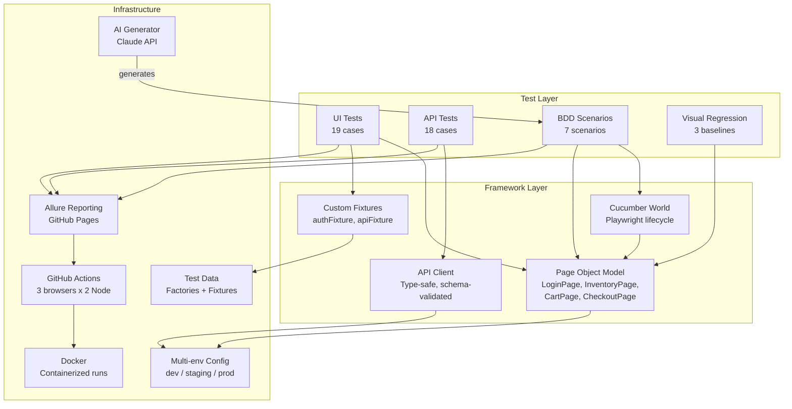

<p align="center">
  
</p>

<h1 align="center">Hybrid E2E Test Automation Framework</h1>

<p align="center">
  Production-grade test automation ecosystem covering UI, API, BDD, visual regression, and AI-powered test generation — built with Playwright + TypeScript.
</p>

<p align="center">
  <a href="https://github.com/usahan/job-hunter/actions/workflows/e2e.yml"></a>
  
  
  
  
  
  
</p>

<p align="center">
  <a href="#quick-start">Quick Start</a> |
  <a href="#architecture">Architecture</a> |
  <a href="#test-coverage">Test Coverage</a> |
  <a href="#cicd-pipeline">CI/CD</a> |
  <a href="#ai-test-generation">AI Test Gen</a> |
  <a href="https://usahan.github.io/job-hunter/">Live Allure Report</a>
</p>

---

## Why This Project?

Most QA portfolios show toy demos with 5 tests and no CI. This repo is different — it's the **full testing ecosystem** a real engineering team needs:

- **UI + API** testing in one unified framework (no context switching)
- **BDD layer** for non-technical stakeholders to read and validate
- **Visual regression** to catch CSS/layout regressions automatically
- **AI-powered test generation** that turns user stories into Gherkin in seconds
- **CI/CD pipeline** with matrix testing across 3 browsers, Allure reporting, and nightly runs
- **Docker support** for reproducible execution anywhere

---

## Tech Stack

| Layer                 | Technology                   | Purpose                                    |
| --------------------- | ---------------------------- | ------------------------------------------ |
| **Language**          | TypeScript (strict mode)     | Type safety, modern async/await            |
| **UI Testing**        | Playwright                   | Cross-browser automation, auto-waiting     |
| **API Testing**       | Playwright APIRequestContext | Unified framework, shared reporting        |
| **BDD**               | Cucumber.js + Gherkin        | Business-readable test specifications      |
| **Schema Validation** | Zod                          | Runtime API response validation            |
| **Test Data**         | Faker.js + JSON fixtures     | Dynamic + deterministic data strategies    |
| **Visual Regression** | Playwright Screenshots       | Pixel-diff comparison with thresholds      |
| **Accessibility**     | axe-playwright               | WCAG compliance checks                     |
| **Reporting**         | Allure                       | Interactive dashboards with history trends |
| **CI/CD**             | GitHub Actions               | Matrix strategy, auto-deploy reports       |
| **Containerization**  | Docker + Compose             | Reproducible environments                  |
| **Code Quality**      | ESLint + Prettier + Husky    | Enforced standards on every commit         |
| **AI Bonus**          | Claude API                   | Generate BDD scenarios from user stories   |

---

## Architecture



---

## Quick Start

### Prerequisites

- Node.js >= 20
- npm >= 9

### Setup

```bash
# Clone and install
git clone https://github.com/usahan/job-hunter.git
cd job-hunter
npm install

# Install browsers
npx playwright install --with-deps

# Run all tests
npm test
```

### Run Specific Test Suites

```bash
# UI tests (Chromium only — fast feedback)
npm run test:ui

# API tests
npm run test:api

# BDD / Cucumber scenarios
npm run test:bdd

# Smoke tests only
npm run test:smoke

# Visual regression (updates baselines on first run)
npm run test:visual

# Run with visible browser
npm run test:headed

# Debug mode (step through with Playwright Inspector)
npm run test:debug
```

### Docker

```bash
# Run tests in a container
docker compose run tests

# Run with Allure report server
docker compose up allure
# Open http://localhost:5252
```

---

## Test Coverage

### UI Tests — SauceDemo (19 cases)

| Spec File           | Cases | Coverage                                                            |
| ------------------- | ----- | ------------------------------------------------------------------- |
| `login.spec.ts`     | 5     | Valid login, locked user, invalid creds, empty fields (data-driven) |
| `inventory.spec.ts` | 6     | Product count, 4 sort variations, product detail navigation         |
| `cart.spec.ts`      | 4     | Add single/multiple items, remove, cart persistence                 |
| `checkout.spec.ts`  | 3     | Full purchase flow, validation errors, return-to-cart               |
| `visual.spec.ts`    | 3     | Login, inventory, and cart baseline screenshots                     |

### API Tests — Petstore (18 cases)

| Spec File       | Cases | Coverage                                                         |
| --------------- | ----- | ---------------------------------------------------------------- |
| `pet.spec.ts`   | 7     | Full CRUD, find by status, 404 handling, response time assertion |
| `store.spec.ts` | 5     | Inventory, order CRUD, 404 handling                              |
| `user.spec.ts`  | 6     | User CRUD, login endpoint, 404 handling                          |

Every API response is validated against **Zod schemas** at runtime — catching contract drift before it reaches production.

### BDD Scenarios (7 scenarios / 44 steps)

| Feature            | Scenarios | Tags                                                                                        |
| ------------------ | --------- | ------------------------------------------------------------------------------------------- |
| `login.feature`    | 4         | `@bdd @smoke` — happy path, locked user, invalid creds, Scenario Outline for missing fields |
| `checkout.feature` | 3         | `@bdd @critical` — single item purchase, multi-item, validation error                       |

### Cross-Browser Matrix

| Browser  | Desktop | Mobile        |
| -------- | ------- | ------------- |
| Chromium | Yes     | Yes (Pixel 5) |
| Firefox  | Yes     | —             |
| WebKit   | Yes     | —             |

---

## Page Object Model

The framework uses a layered POM architecture with **zero assertions in page objects**:

```
BasePage (abstract)
├── LoginPage          — credentials, login, error handling
├── InventoryPage      — product listing, sorting, filtering
│   └── ProductCardComponent  — scoped per-product interactions
├── CartPage           — item management, checkout navigation
├── CheckoutPage       — two-step form (info + overview)
└── CheckoutCompletePage — order confirmation

HeaderComponent        — reusable across all authenticated pages
```

**Design principles:**

- **No hard waits** — relies on Playwright's auto-waiting
- **`data-test` locators** — resilient to CSS/text changes
- **Scoped components** — `ProductCardComponent` operates within its DOM subtree
- **Assertions stay in tests** — pages describe behavior, tests verify it

---

## CI/CD Pipeline

The GitHub Actions pipeline runs on every PR, push to `main`, and nightly at 2:00 AM UTC:

```
Push / PR to main
       │
       ▼
┌─────────────────┐
│  quality gate   │  ESLint + TypeScript + Prettier (~30s)
└────────┬────────┘
         │
    ┌────┴────┐
    ▼         ▼
┌────────┐ ┌────────┐
│  test  │ │  bdd   │  Run in parallel
│ matrix │ │        │
│ 3×2=6  │ │  7     │
│ combos │ │ scens  │
└───┬────┘ └───┬────┘
    │          │
    ▼          ▼
┌─────────────────┐
│  allure report  │  Merge results → Deploy to GitHub Pages
└─────────────────┘
```

**Key features:**

- **Matrix strategy:** 3 browsers x 2 Node versions (20, 22) = 6 parallel jobs
- **`fail-fast: false`** — all combos finish even if one fails
- **API tests run once** (browser-independent) to save CI minutes
- **Artifacts:** screenshots, videos, and traces uploaded on failure
- **Allure history** cached for trend charts across runs
- **Concurrency control** — new pushes cancel stale in-progress runs

---

## AI Test Generation

Generate BDD scenarios from plain-English user stories using the Claude API:

```bash
npm run generate:tests -- --story "As a user, I want to sort products by price"
```

The script:

1. Sends the user story to Claude with full app context (pages, users, existing steps)
2. Returns 4-6 Gherkin scenarios covering happy paths, edge cases, and data-driven variations
3. Reuses existing step definitions — marks new steps with `# NEW STEP` comments
4. Saves the `.feature` file to `features/generated-*.feature`

```bash
# From a file containing multiple stories
npm run generate:tests -- --file user-stories.txt
```

> Set `ANTHROPIC_API_KEY` in your `.env` file to enable this feature.

---

## Environment Configuration

The framework supports multiple environments via `.env` files:

```bash
# Run against staging
TEST_ENV=staging npm test

# Run against production (read-only tests)
TEST_ENV=prod npm run test:smoke
```

| Variable            | Default                          | Purpose                |
| ------------------- | -------------------------------- | ---------------------- |
| `TEST_ENV`          | `dev`                            | Environment selector   |
| `BASE_URL`          | `https://www.saucedemo.com`      | UI target              |
| `API_BASE_URL`      | `https://petstore.swagger.io/v2` | API target             |
| `UI_USERNAME`       | `standard_user`                  | Login credentials      |
| `UI_PASSWORD`       | `secret_sauce`                   | Login credentials      |
| `ANTHROPIC_API_KEY` | —                                | For AI test generation |

---

## How to Add New Tests

### Adding a UI Test

1. **Create a page object** (if the page doesn't have one yet):

   ```typescript
   // pages/my-new.page.ts
   export class MyNewPage extends BasePage {
     protected readonly path = '/my-page';
     readonly someElement = this.page.locator('[data-test="element"]');
   }
   ```

2. **Write the test**:

   ```typescript
   // tests/ui/my-new.spec.ts
   import { test, expect } from '../../fixtures/test-base.js';
   import { MyNewPage } from '../../pages/my-new.page.js';

   test.describe('My Feature @regression', () => {
     test('should do something', async ({ authenticatedPage }) => {
       const page = new MyNewPage(authenticatedPage);
       await page.goto();
       await expect(page.someElement).toBeVisible();
     });
   });
   ```

### Adding a BDD Scenario

1. **Write the feature** in `features/my-feature.feature`
2. **Add step definitions** in `features/step-definitions/my-feature.steps.ts`
3. **Register** the step file in `cucumber.cjs` require array
4. **Or generate it**: `npm run generate:tests -- --story "your user story"`

### Adding an API Test

1. **Define the schema** in `api/schemas/`
2. **Create the endpoint class** in `api/endpoints/`
3. **Write the test** in `tests/api/`

---

## Project Structure

```
hybrid-e2e-framework/
├── .github/workflows/
│   └── e2e.yml              # CI/CD pipeline (matrix + Allure deploy)
├── api/
│   ├── client.ts             # Type-safe API client wrapper
│   ├── endpoints/            # Pet, Store, User endpoint classes
│   └── schemas/              # Zod schemas for response validation
├── config/
│   └── index.ts              # Centralized multi-env config
├── data/
│   ├── factories/            # Dynamic test data (Faker.js)
│   └── fixtures/             # Static test data (users, products)
├── features/
│   ├── login.feature         # BDD: login scenarios
│   ├── checkout.feature      # BDD: checkout e2e flow
│   ├── step-definitions/     # Cucumber step implementations
│   └── support/              # World + hooks (Playwright lifecycle)
├── fixtures/
│   ├── auth.fixture.ts       # Pre-authenticated page fixture
│   ├── api.fixture.ts        # API client fixture
│   └── test-base.ts          # Merged fixture exports
├── pages/
│   ├── base.page.ts          # Abstract base (navigation, waits)
│   ├── login.page.ts         # Login page object
│   ├── inventory.page.ts     # Product listing page
│   ├── cart.page.ts          # Shopping cart page
│   ├── checkout.page.ts      # Checkout (step 1 + step 2)
│   ├── checkout-complete.page.ts
│   └── components/           # Reusable UI components
├── scripts/
│   ├── setup-global.ts       # Health check before test run
│   └── generate-tests.ts     # AI-powered Gherkin generator
├── tests/
│   ├── ui/                   # UI specs (login, cart, checkout, visual)
│   └── api/                  # API specs (pet, store, user)
├── playwright.config.ts      # Playwright config (5 projects)
├── cucumber.cjs              # Cucumber BDD config
├── docker-compose.yml        # Docker test + Allure services
├── Dockerfile                # Multi-stage Playwright image
└── tsconfig.json             # TypeScript strict config + path aliases
```

---

## Reporting

### Allure Report (CI)

Every pipeline run generates an interactive Allure report deployed to GitHub Pages:

**[View Live Report](https://usahan.github.io/job-hunter/)**

Features: test history trends, failure screenshots, step-by-step execution, environment metadata.

### Local Reports

```bash
# Generate and open Allure report
npm run report:generate
npm run report:open

# Or serve with live reload
npm run report:serve

# Playwright HTML report
npx playwright show-report
```

---

## Design Decisions

See [ARCHITECTURE.md](ARCHITECTURE.md) for detailed rationale behind:

- Why Playwright over Cypress/Selenium
- Why Zod for schema validation instead of JSON Schema
- Why merged fixtures over the extend-chain pattern
- Why CommonJS for Cucumber config on Windows
- Why `data-test` attributes over CSS selectors

---

## License

MIT - see [LICENSE](LICENSE) for details.

---

<p align="center">
  Built with Playwright, TypeScript, and attention to detail.<br/>
  <a href="https://github.com/usahan/job-hunter">Star this repo</a> if it helped you.
</p>
